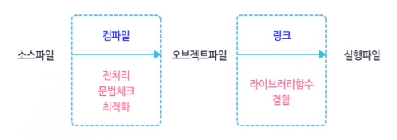

### 2. 나의 첫 번째 C 프로그램

#### 1) C프로그램의 기본 구성

* 프로그램 형식
  * C프로그램의 구성
    * 1개 이상의 함수로 구성
    * 함수는 1개 이상의 명령문(statement)을 포함

  * C언어에서의 함수의 형식

    ```c
    리턴_자료형 함수_이름(매개변수 목록)
    {
        명령문1;
        명령문2;
        ...
        명령문N;
    }
    ```

    * `리턴 자료형` : 함수에서 반환하는 값의 자료형
    * `함수 이름` : 함수를 호출할 때 전달되는 값들을 받아올 변수를 선언
      * 만약 호출 시 받아올 값이 없는 경우에는 생략해도 됨
    * `매개변수 목록` : 영문 대소문자, 숫자, _(underscore)만을 사용
      * 함수 이름의 첫 글자로 숫자는 이용할 수 없음
      * 대문자와 소문자는 구분됨(myfunction 과 MYFUNCTION은 서로 다른 함수)
    * `명령문` : 함수가 호출될 때 수행해야 할 명령문
      * 각 명령문 끝에는 반드시 ;을 붙여줘야 함
    * `{}` : 함수의 시작과 끝, 함수의 블록
    * 함수의 형식의 함수 중 대표적인 함수가 main(메인)함수

* main 함수

  * C프로그램 실행 시 최초로 호출되는 함수

  * 프로그램이 실행될 때 main함수에 포함된 명령문들을 제일 먼저 수행

  * 프로그램 작성 시 반드시 구성해야할 함수

  * 프로그램 내에는 반드시 한개의 main함수만 존재

  * main함수의 원형

    ```c
    int main(void)
    {
        명령문;
        명령문;
        ...
        return 0;
    }
    ```

  * `int`

    * 정수형

  * `void`

    * main함수 호출 시 전달되는 값들을 받지 않는다는 의미
    * 프로그램 실행 시 외부에서 전달하는 값들을 프로그램 안에서 처리하지 않겠다는 의미

  * `{}`

    * 블록 내의 명령문들을 처리하고 마지막에 0을 반환

  * main 함수의 반환 값은 정상적으로 프로그램을 종료하는 경우에는 0을, 비정상적인 종료인 경우에는 0 아닌 값을 반환

* 주석처리

  * 프로그램 작성 시 소스코드에 주석문 달아놓기

  * 시간이 지난 후 다시 들여다볼 때 다른 사람이 분석해야 할 때 많은 도움이 됨

  * 소스코드 작성 시 가급적 많은 주석문을 다는 것이 좋음

  * **분석하기 좋고 읽기 좋은 프로그램이 좋은 프로그램임**

  * C 언어에서 주석 처리 방법

    ```c
    /*
    여러 줄 주석 처리
    */
    ```

    ```c
    // 한 줄 주석 처리
    ```

#### 2) 표준 입출력 함수

* 사용자로부터 입력 받는 일, 모니터로 출력하는 일을 표준 입출력 함수를 통해 구현

* C언어 프로그램의 입출력은 모두 스트림(stream)을 통해서 이루어짐

* `스트림` : 일련의 바이트로 구성된 데이터의 흐름으로 장치의 종류와 관계없이 동일한 방법으로 입출력을 수행

  * `동일한 방법` = `동일한 입출력 함수`

* 입출력 장치와 스트림과의 관계

  | 스트림               | 의미      | 표준입출력 장치 |
  | -------------------- | --------- | --------------- |
  | stdin(에스티디인)    | 표준 입력 | 키보드          |
  | stdout(에스티디아웃) | 표준 출력 | 모니터          |
  | stderr(에스티디에러) | 표준 오류 | 모니터          |

  * 프로그램 작성 시 표준입출력 함수를 이용할 때에는 헤더 파일을 반드시 포함시켜야 함
    * 표준 입출력 함수에 대한 정보다 이 헤더파일에 저장되어 있기 때문
    * #include <stdio.h>
  * 주의 사항
    * C언어에서의 명령문 끝에는 반드시 ;(세미콜론)을 붙여야 함
    * '#'으로 시작되는 명령문은 ;을 붙이면 안됨
      * 전처리문이라고 하며 컴파일 시 제일 먼저 처리하는 명령문

* `printf함수`

  * printf("My First Program\n");

  * " " 안에 있는 My First Program 문자열을 화면으로 출력

  * 프로그램 수행 중 사용자가 사용하는 화면에 무언가 출력할 것이 있을 때 사용하는 표준 출력 함수

  * 출력 내용은 문자열 뿐만 아니라 형식 지정자를 이용하면 다양한 유형의 데이터를 출력 가능

  * print함수의 사용법

    * printf("형식지정자", 인수1, 인수2, .., 인수N);

    * `형식지정자` : 다양한 자료형을 각각의 지정자로 표현 가능, 인수들과 1:1로 대응

    * " " 안에는 형식지정자와 함께 제어 문자도 표현 가능

    * 형식 지정자의 의미

      | 형식 지정자 | 의미                                |
      | ----------- | ----------------------------------- |
      | %c          | 문자 한 개                          |
      | %d          | 부호가 있는 정수로서 10진수         |
      | %e          | 과학 계산용 표기(소문자'e')         |
      | %E          | 과학 계산용 표기(대문자'E')         |
      | %f          | 실수로서 10진수                     |
      | %g          | %e와 %f 중 더 짧은 표현 사용        |
      | %G          | %E와 %f 중 더 짧은 표현 사용        |
      | %o          | 부호가 없는 정수로서 8진수          |
      | %s          | 문자열                              |
      | %u          | 부호가 없는 정수로서 10진수         |
      | %x          | 부호가 없는 정수로서 16진수(소문자) |
      | %X          | 부호가 없는 정수로서 16진수(대문자) |
      | %p          | 포인터, 즉 메모리의 주소를 출력     |
      | %%          | %문자를 출력                        |

    * 제어 문자의 의미

      | 제어문자 | 의미                  |
      | -------- | --------------------- |
      | \n       | 줄 바꿈(개행 문자)    |
      | \t       | <TAB>만큼 띄움        |
      | \b       | 이전 문자 지우기      |
      | \r       | 줄 맨 앞으로 이동     |
      | \\\      | \\(역슬래시)문자 출력 |
      | \\'      | '(단일 따옴표) 출력   |
      | \\"      | "(이중 따옴표) 출력   |

    * 프로그램에서 처리한 결과들을 화면에 출력하는 방법

      1. 각 자료형에 맞춰 형식 지정자를 " 와 " 사이에 나열하고 출력하고 싶은 값들을 인수 목록에 차례대로 나열
      2. 형식 지정자의 개수와 인수의 개수 일치
      3. 형식지정자와 자료형이 서로 맞지 않으면 프로그램이 오동작하거나 강제로 종료

  * 출력 형식의 조정

    * 프로그램의 수행 결과를 보기 좋게 출력하려면 일정한 간격으로 출력하는 것이 좋음
    
    * printf함수 형식 지정자
    
      * "%[+|-]자릿수[.소수점이하자릿수]지정자"
      * 자릿수 앞에 -를 붙이면 우측 정렬 기준에서 좌측 정렬 기준으로 정렬 기준이 바뀜
    
    * 자료형 별 사용 예
    
      | 자료형 | 사용법                         |
      | ------ | ------------------------------ |
      | 정수형 | %자릿수d                       |
      | 정수형 | %-자릿수d                      |
      | 실수형 | %유효자릿수.소수점이하자릿수f  |
      | 실수형 | %-유효자릿수.소수점이하자릿수f |
      | 문자열 | %자릿수s                       |
      | 문자열 | %-자릿수s                      |

* `scanf 함수`

  * 프로그램 수행도중 사용자로부터 입력을 처리해야 하는 경우

  * 형식화된 입력 함수로 형식 지정자를 이용하여 다양한 자료형의 데이터를 입력 제공 가능

  * `변수` : 입력 받기 위함 임의 공간

  * scanf함수의 사용법

    * `scanf 함수` : 공백 문자나 <엔터>키를 구분자로 입력받는 함수

    * scanf함수 형식 지정자

      * scanf("형식지정자", &변수1, &변수2, ..., &변수N);
      * `&` : 주소 연산자
      * scanf함수를 이용할 때는 변수 앞에 &을 붙임
      * 연산자를 붙이지 않는다면 프로그램 실행 시 예기치 않은 종료 발생

      | 형식 지정자 | 의미                                          |
      | ----------- | --------------------------------------------- |
      | %c          | 문자 한 개 입력                               |
      | %d          | 10진수로 된 정수 입력                         |
      | %e          | 실수 입력                                     |
      | %f          | 실수입력(float형)                             |
      | %ls         | 실수입력(double형)                            |
      | %g          | 실수 입력                                     |
      | %o          | 8진수의 부호 없는 정수 입력                   |
      | %s          | 문자열 입력                                   |
      | %x          | 16진수의 부호 없는 정수 입력                  |
      | %p          | 포인터 입력                                   |
      | %n          | 지금까지 읽은 문자 개수 입력                  |
      | %u          | 10진수의 부호 없는 정수 입력                  |
      | %[ ]        | [ ] 사이에 나열된 문자에 해당되는 문자만 입력 |

      * scanf함수를 이용할 때에는 제어문자 사용 금지

#### 3) 나의 첫 번째 프로그램

* 컴파일하기

  * `컴파일` : C언어로 작성한 소스코드를 CPU가 실행할 수 있는 기계에 코드로 만들어 주는 것

  * 컴파일 과정 2단계

    

  * 1단계 전처리문 처리

    * 소스코드를 문법체크 하기 전 전처리문 먼저 처리
    * 전처리문은 '#'으로 시작되는 명령문으로 소스코드 재정리
    * `#include`, `#define`, `#ifdef`
    * 명령문 끝에 ;(세미콜론)이 없음
    * 문법 체크 후 소스코드 중 일부는 속도 향상 최적화 코드로 변경
    * 여기서 만들어지는 파일 -> 오브젝트 파일
    * 아직 실행단계 아님

  * 2단계 링크 과정

    * 소스코드에서 라이브러리 함수를 호출
    * 함수의 오브젝트 코드와 함께 결함 -> 실행 파일 완성
    * 라이브러리 함수는 프로그램 작성 시 사용되는 기능을 미리 함수로 정의해 놓은 것
    * 컴파일 방법은 개발 도구에 따라 다름
      * 통합 개발 도구 이용(visual studio, eclipse 등)
      * 직접 컴파일러 수행

  * C컴파일러 사용법

    * C컴파일러 옵션 소스 파일명

    * Unix - cc

    * Linux - gcc

    * C 컴파일러에서 자주 사용하는 주요 옵션

      | 주요 옵션   | 의미                                                         |
      | ----------- | ------------------------------------------------------------ |
      | -o filename | 컴파일 결과를 지정한 filename에 저장                         |
      | -c          | 오브젝트 파일까지만 생성(.o 또는 .obj확장자)<br />여러개의 소스파일로 나누어 개발할 떄 유용하게 사용 |
      | -l libname  | 표준 C 라이브러리가 아닌 그 이외의 라이브러리 결합 시 libname 결합<br />여기서 libname은 라이브러리 파일명 lib_libname.a로 확장 |
      | -g          | 실행 파일에 디버깅에 필요한 정보가 포함<br />디버깅이 필요할 때에는 컴파일 시 이 옵션을 함께 컴파일해야 함<br />Visual Studio에서는 디버깅 모드로 빌드하는 방법이 이 옵션에 해당 |

  * C 소스코드를 컴파일 하기

    * 컴파일 시 소스코드에 문제가 없다면 '컴파일이 성공했습니다.' 와 같은 메시지가 출력, 아무 메시지 없이 프롬프트가 나타남

  * 컴파일이 완료된 후 

    * 직접 컴파일러 이용 -> 실행파일 이용 실행
    * 통합 개발 환경 -> 단축기 이용 실행
    * 직접 실행 환경 -> 명령 실행하는 터미널에서 직접 실행파일명 입력

