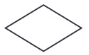
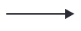

### 4. 선택의 흐름이 필요한 경우 - 선택문의 사용

#### 1) 프로그램 구조

* 프로그램 구조

  * C 언어의 규칙에 따라 차례대로 나열

    * 차례대로 수행되는 순차적인 구조

  * 제어문으로 표현

    * 조건에 따라 다르게 수행되는 선택 구조
    * 일정한 조건에 따라 여러 번 수행되는 반복 구조

  * `제어문`

    * 프로그램의 **수행 순서를 변경**
    * 조건 식의 수행 결과에 따라 **참 또는 거짓으로 나뉨**
    * 참과 거짓이 수행되는 서로 **구분되어 처리**

  * 프로그램의 흐름을 표현하는 방법

    * 사람의 사고, 즉 논리를 표현하는데 적합한 프로그램 언어
    * 문제 해결 방법을 논리로 정리, 순서도의 기호를 이용하여 표현
    * `순서도` : 프로그램의 흐름, 즉 논리를 기호로 이해하기 쉽게 표현하는 방법(Flow-Chart, NS-Chart, Pseudo Code 등)

  * 플로우 차트 기호

    | 기호                                       | 설명                                   |
    | ------------------------------------------ | -------------------------------------- |
    |  | 순차 구조의 명령문을 표현하는 기호     |
    |  | 조건을 판별해야 할 때 이용하는 기호    |
    |  | 프로그램의 흐름을 나타내는 기호        |
    |  | 프로그램의 시작과 종료를 표현하는 기호 |
    |  | 프로그램의 흐름을 연결하는 연결자 기호 |

#### 2) if조건문

* if 선택문은 언제 사용할까요?

  * 조건이 참인지 거짓인지에 따라 수행 부분 결정

* 단순 if 문

  * 조건식의 수행 결과가 참이면 명령문 실행

  * 거짓이면 명령문을 실행하지 않음

  * 조건식에는 C언어에서 사용 가능한 표현식을 모두 이용할 수 있음

    ```c
    // 형식 1
    if (조건식)
        명령문;
    
    // 형식 2
    if (조건식) {
        명령문1;
        명령문2;
    }
    ```

    * 명령문이 하나면 중괄호({}) 생략 가능

* if - else 문

  * 조건식의 수행 결과가 참이면 명령문이 실행됨

  * 거짓이면 제 2의 명령문이 실행됨

    ```C
    // 형식 1
    if (조건식) 
        명령문1;
    else
        명령문2;
    
    // 형식 2
    if (조건식) {
        명령문 1-1;
        명령문 1-2;
        ...
    } else {
        명령문 2-1;
        명령문 2-2;
        ...
    }
    ```

    * 형식 1
      * 조건식이 참인 경우 명령문1 실행, 거짓인 경우 명령문 2 실행
    * 형식 2
      * 조건식이 참인 경우 명령문1-1, 명령문 1-2 실행, 거짓인 경우 명령문2-1, 명령문2-2 실행

* 다중 if 문

  * 조건식을 여러개 판별할 경우에 사용

    ```c
    if (조건식1)
        명령문1;
    else if (조건식2)
        명령문2;
    ...
    else if(조건식N)
        명령문N;
    else
        명령문O;
    ```

#### 3) switch 선택문

* switch 문의 형식

  * 여러개 중 하나를 선택하는 구조에서 다중 if문 대신 switch 문을 이용할 수 있음

  * 조건식의 수행 결과가 참이나 거짓이 아니라 특정한 값으로 나오는 경우

  * 소스 프로그램을 이해하기 쉽고 나중에 변경할 일이 있을 때 변경이 용이

  * if문과 switch 문 사용의 차이점

    * if문
      * 조건식을 처음부터 일일이 비교해 나가는 방식
      * 다중 if문으로 구현해야만 하는 경우가 있음
    * switch 문
      * 코드를 읽고 분석, 수정하기에 더 편리함
      * 실행 속도 면에서도 좀 더 우수함
      * 여러 case 중 하나만 선택되어 시행하는 구조이므로 성능 면에서 더 우수함
      * case에서 정수 및 문자 상수만 사용 가능

    ```c
    switch (조건식) {
        case 값1:
            명령문1-1;
            명령문1-2;
            ...
            break;
        case 값2:
            명령문2-1;
            명령문2-2;
            ...
            break;
         ....
        default:
            명령문N-1;
            명령문N-2;
            ...
            break;
    }
    ```

    * case의 값들은 정수형 상수나 문자 상수만 가능, 실수형 상수나 문자열 상수는 사용 불가
    * 조건식의 수행결과에 해당하는 값이 있는 경우 break 명령문을 만날 때까지 명령문을 실행한 후 switch문을 벗어남
    * 수행 결과가 나열된 값에 해당되지 않는 경우 default에 해당하는 명령문들을 실행, break명령문을 만나면 switch문을 벗어남, default의 break문은 생략 가능

#### 4) goto 문

* goto 문의 형식

  * 프로그램 실행 도중 **어느 특정 위치로 이동**해야하는 경우

  * goto문을 만나면 label이 있는 위치로 무조건 이동(사용 전 label 설정 필요)

  * 반복문 안에 반복문이 여러 번 중첩되어 있는 경우(단번에 반복문을 모두 벗어날 수 있음)

  * goto문을 잘못 사용하면 프로그램의 수행이 무한 반복되거나 예상치 못한 수행이 진행

  * 잘 구성된 프로그램이라면 goto 문을 사용하지 않는 것이 좋음

    ```c
    label명:
    	.
        .
        .
        goto label명;
    ```

    * label명: 이용하여 label로 이동

