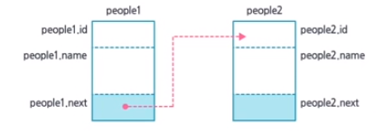
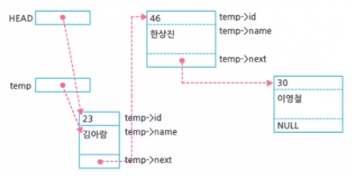
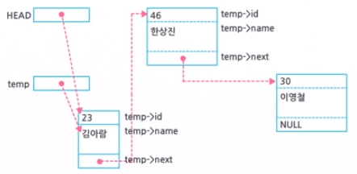
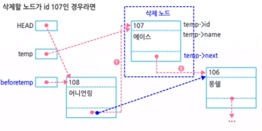
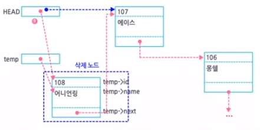

### 4. 반드시 알아두어야 하는 구조체/공용체

#### 1) 구조체

* 구조체의 개념

  * 30명 학생의 성적 처리를 위해 평균 점수를 구하기 위한 배열 선언

    ```c
    char st_name[30][20];
    int kor[30], math[30], eng[30];
    float avg[30];
    ```

    * 2번 학생의 자료를 1번 학생의 자료로 복사하는 경우 각 배열의 원소를 하나씩 복사

      ```c
      strcpy(st_name[0], st_name[1]);
      kor[0] = kor[1];
      math[0] = math[1];
      eng[0] = eng[1];
      avg[0] = avg[1];
      ```

  * 서로 다른 자료형이 한 개체를 기술하고 있는 경우 구조체 자료형으로 구성

  * 한꺼번에 데이터 처리 가능해 훨씬 효율적인 프로그램 제작

* 구조체 변수의 선언

  * 구조체 자료형에 대한 선언부터 해야 함

  * 형식

    ```c
    struct 태그명 {
        자료형 멤버변수1;
        자료형 멤버변수2;
        	.
            .
            .
        자료형 멤버변수N;
    }
    ```

    * `struct` : 키워드, 구조체 자료형에 대한 선언임을 컴파일러에게 알려주는 지시자
    * `태그명` : 새로운 구조체 형에 대한 이름, 개발자가 임의로 부여
    * `struct 태그명` : 자료형의 이름
    * `자료형 멤버변수` : 구조체를 구성하는 구성 요소, 멤버들 선언

  * 학생 이름, 국어, 영어, 수학 점수 그리고 평균 점수의 5가지 정보의 구조체 자료형 표현

    ```c
    struct score {
        char name[20];
        int kor;
        int math;
        int eng;
        float avg;
    }
    ```

  * typedef 지시자를 이용, 자료형의 이름을 재정의해서 사용

    ```c
    typedef struct score {
        char st_name[20];
        int kor;
        int math;
        int eng;
        float avg;
    }SCORE;
    ```

    * `typedef` : 5가지 멤버로 구성된 struct형을 SCORE라는 이름으로 새로 정의
    * SCORE는 변수의 이름이 아닌 자료형의 이름
    * 이 자료형으로 변수를 선언해야 사용할 수 있음

* 구조체 변수 선언

  * 일반 변수를 선언하는 방법과 동일

  * 형식

    ```c
    구조체자료형 구조체변수명;
    ```

  * 구조체 자료형을 이용하여 변수 선언

    ```c
    struct score student;
    ```

    * `struct score` : 자료형의 이름

    * `student` : 변수명

    * 자료형의 이름이 기본 자료형의 이름보다 길고 변수명과 혼동하기 쉬울 때 typedef로 재정의한 이름 사용

      ```C
      SCORE student;
      ```

  * 구조체 변수 선언 방법 3가지

    1. 구조체 자료형의 선언과 변수 선언을 함께하는 방법

       ```c
       struct typeA {
           int member1;
           float member2;
           double member3;
           char member4;
       } var;
       ```

    2. 구조체 자료형의 선언과 변수 선언을 따로 하는 방법

       ```c
       struct typeA {
           int member1; 
           float member2;
           double member3;
           char member4;
       };
       struct typeA var;
       ```

    3. 태그명을 붙이지 않고 자료형과 변수를 동시에 선언하는 방법

       ```c
       struct {
           int member1; 
           float member2;
           double member3;
           char member4;
       } var;
       ```

* 구조체 변수의 사용

  * 구조체 선언시 선언한 멤버 순서대로 메모리를 할당받음

    * 전체를 한꺼번에 취급 가능
    * 그 안의 멤버들을 따로따로 취급 가능

  * 구조체 변수의 멤버들을 나타낼 때에는 변수 명 바로 옆에 .(점)과 멤버명을 붙여서 표현

  * 구조체의 멤버들을 처리할 때에는 멤버들의 자료형에 맞추어 처리

    * `student.name` : 1차원의 문자 배열
    * `student.kor`, `student.math`, `student.eng` : int 형 변수
    * `student.avg` : float 형 변수

  * 예

    ```c
    strcpy(student.name, "홍길동");
    student.kor = 90;
    student.math = 86;
    student.eng = 95;
    student.avg = (student.kor + student.math + student.eng)/3.0;
    ```

  * 동일한 구조체 자료형의 변수는 대입 연산자를 이용하여 한번에 대입 가능

    ```c
    SCORE student1, student2;
    ...
    student2 = student1
    ```

    * student1 변수에 있는 모든 멤버(name, kor, math, eng, avg)가 student2 변수의 모든 멤버로 대입됨
    * 구조체 자료형은 하나의 개체에 대한 속성을 한꺼번에 다룰 수 있고, 각 속성을 따로 다룰 수도 있음

  * 예제 1 ) 구조체 변수를 사용하는 프로그램

    ```c
    #include <stdio.h>
    int main(void)
    {
    	struct score {
    		char name[20];
    		int kor;
    		int math;
    		int eng;
    		float avg;
    	} student1, student2;
    
    	printf("학생의 이름:");
    	// 학생 이름은 문자열이므로 gets함수 이용
    	gets(student1.name);
    	printf("국어 점수?");
    	scanf("%d", &student1.kor);
    	printf("수학 점수?");
    	scanf("%d", &student1.math);
    	printf("영어 점수?");
    	scanf("%d", &student1.eng);
    	student1.avg = (student1.kor + student1.math + student1.eng) / 3.0;
    
    	student2 = student1;
    	printf("student2.name : %s\n", student2.name);
    	printf("student2.kor : %d\n", student2.kor);
    	printf("student2.math : %d\n", student2.math);
    	printf("student2.eng : %d\n", student2.eng);
    	printf("student2.avg : %1f\n", student2.avg);
    
    	return 0;
    }
    ```

* 구조체 변수 초기화

  * 방법

    * 중괄호({ }) 사이에 각 멤버에 초기화 할 값을 , 로 나열

  * 순서

    * 구조체에 선언된 멤버의 순서대로 나열

  * 예

    ```c
    struct score student = {"kim", 90, 85, 93, 0.0};
    ```

  * 구조체 변수의 자료형의 크기를 알아야 할 때 `sizeof`함수 사용

    ```c
    printf("자료형의 크기 = %d\n", sizeof(struct score));
    ```

    * struct score 자료형의 크기를 바이트 수로 출력

#### 2) 구조체 배열

* `구조체 변수` : 서로 관련된 속성들을 모아서 한꺼번에 처리할 수 있는 자료 구조로 표현하는 기본 단위

  * 여러 명에 대한 처리가 필요한 경우 구조체 배열 이용

  * 선언

    ```c
    struct score st[30];
    // SCORE st[30]; 과 동일
    ```

  * 예제 2) 구조체 배열을 다루는 프로그램**12:24**

    ```c
    #include <stdio.h>
    
    #define MAX 30
    int main()
    {
    	typedef struct score {
    		char name[20];
    		int kor;
    		int math;
    		int eng;
    		float avg;
    	} SCORE;
    
    	// 구조체 배열 st를 선언
    	SCORE st[MAX];
    	int n;
    
    	for (n = 0; n < MAX; n++) {
    		printf("학생의 이름은?");
    		gets(st[n].name);
    		printf("국어 수학 영어 점수?");
    		scanf("%d%d%d *c", &st[n].kor, &st[n].math, &st[n].eng);
    		st[n].avg = (float)(st[n].kor + st[n].math + st[n].eng) / 3;
    	}
    	printf("번호\t이름\t국어\t수학\t영어\t평균\n");
    	for (n = 0; n < MAX; n++) {
    		printf("%d\t%s\t%d\t%d\t%d\t%.1f\n",
    			n + 1, st[n].name, st[n].kor, st[n].math, st[n].eng, st[n].avg);
    	}
    	return 0;
     }
    ```

#### 3) 구조체와 포인터

* `포인터 변수` : 메모리의 주소를 저장할 수 있는 변수

  * 자료형은 포인터 변수가 가리키는 메모리의 자료형을 의미

* `구조체 포인터 변수` : 주소를 저장할 수 있는 변수

  * 구조체 포인터 변수가 가리키는 메모리의 자료형이 구조체임을 의미

* 구조체 포인터 변수 선언의 예

  * 형식

    ```C
    구조체자료형* 구조체포인터변수명;
    ```

    ```c
    typedef struct member {
        int id;
        char name[20];
    } MEMBER;
    
    MEMBER* ptr;		// ptr : 구조체 포인터 변수
    MEMBER person;		// person : 구조체 변수
    ```

    * 포인터 변수에는 주소를 저장할 수 있으므로 `ptr = & person;`

    * 구조체 포인터 변수를 이용하여 멤버를 표현(멤버의 자료형을 맞춰 사용)

    * 화살표 연산자를 이용

    * person.id = ptr -> id

    * person.name = ptr -> name

    * 구조체 포인터 변수 ptr을 이용하여 표준 입력을 통해 각 멤버를 입력 받으려면

      ```c
      scanf("%d", &ptr->id);
      gets(ptr->name);
      ```

  * 구조체 배열과 구조체 포인터 변수의 관계

    ```c
    MEMBER* ptr;
    MEMBER marray[100];
    ```

    * 구조체 포인터 변수 ptr과 구조페 배열 marray를 선언, ptr구조체 포인터 변수가 marray구조체 시작 주소를 가리킴

    * 포인터 변수에서 연산은 자료형의 크기만큼 이루어짐

      > ptr은 첫번째 원소, ptr+1은 두번째 원소, ptr+3은 세번째 원소
      >
      > *ptr은 marray[0], *(ptr+1)은 marray[1], *(ptr+2)는 marray[2] 의미

  * 예제 3 ) 구조체 배열과 구조체 포인터 변수의 적용

    ```c
    #include <stdio.h>
    #include <stdlib.h>
    
    #define MAX 10
    
    int main()
    {
    	typedef struct member {
    		int id;
    		char name[20];
    	} MEMBER;
    
    	int i, count;
    	MEMBER* ptr;
    	MEMBER marray[MAX];
    
    	ptr = marray;
    	for (i = 0; i < MAX; i++) {
    		printf("ID입력:");
    		scanf("%d%*c", &ptr->id);
    		if (ptr->id == -1)
    			break;
    		printf("이름 입력:");
    		gets(ptr->name);
    		ptr++;		// 다음 원소로 포인터 이동
    	}
    	count = i;
    	ptr = marray;
    	for (i = 0; i < MAX; i++) {
    		printf("id : %d, name : %s \n",
    			(ptr + i)->id, (ptr + i)->name);
    	}
    	return 0;
    }
    ```

* 동적 메모리와 구조체 포인터 변수

  * 구조체 포인터 변수도 동적 메모리를 할당받아 주소를 저장

  * 필요한 메모리를 확보할 수 있고 필요 없게 되면 반납함으로써 효율적인 메모리 관리 프로그램 작성 가능

  * 예제 4) 구조체 포인터 변수를 이용한 프로그램

    ```c
    #include <stdio.h>
    #include <stdlib.h>
    
    #define MAX 10
    
    int main()
    {
    	typedef struct member {
    		int id;
    		char name[20];
    	} MEMBER;
    
    	int i, count;
    	MEMBER* ptr;
    	MEMBER* parray[MAX];
    
    	ptr = parray;
    	for (i = 0; i < MAX; i++) {
    		ptr = (MEMBER*)malloc(sizeof(MEMBER));
    		if (ptr == NULL) {
    			printf("메모리를 더 이상 할당할 수 없습니다.\n");
    			return 1;
    		}
    		printf("ID입력:");
    		scanf("%d%*c", &ptr->id);
    		if (ptr->id == -1)
    			break;
    		printf("이름 입력:");
    		gets(ptr->name);
    		parray[i] = ptr;
    	}
    	count = i;
    	for (i = 0; i < MAX; i++) {
    		printf("id : %d, name : %s \n",
    			parray[i]->id, parray[i]->name);
    	}
    	free(ptr);
    	for (i = 0; i < count; i++) {
    		free(parray[i]);
    	}
    	return 0;
    }
    ```

* `중첩된 구조체` : 구조체 안에 또 다른 구조체를 하나의 멤버로 포함시킬 수 있는 것

  ```c
  struct id_type {
      int age;
      char addr[80]
          struct member info;
  } people;
  ```

  * 각 멤버에 대한 처리는 마지막 멤버의 자료형에 맞추어 처리

    * people.age - 정수형 변수

    * people.addr - 1차원 문자 배열

    * people.info.id - 정수형 변수

    * peopel.info.name - 1차원의 문자 배열

      ```c
      people.age = 30;
      strcpy(people.addr, "Seoul");
      	People.info.id = 1010;
      strcpy(people.info.name, "이선희");
      ```

    * 멤버 안에 있는 멤버들의 표현 주의

  * `자기 참조형 구조체` : 구조체 안에 다른 구조체가 아닌 자기 자시의 구조체형을 가리키는 포인터 멤버가 포함된 자료형

    ```c
    typedef struct member {
        int id;
        char name[20];
        struct memver* next;
    } MTYPE;
    MTYPE people1, people2;
    ```

    * `peopel1` , `people2` : 구조체 MTYPE 자료형의 변수
    * `next` : 포인터 멤버, 같은 구조체 자료형의 변수 메모리의 주소를 저장 가능
    * people1.next = &people2;

  * 중첩된 구조체 변수에서 멤버의 표현

    

    * people1과 people2가 people1.next 멤버를 통해 연결된 상태
    * people2.id는 people1.next -> id와 동일
    * people2.name은 people1.next -> name과 동일함
    * people3, people4 등등 구조체 변수를 계속 선언한다면 서로 연결하는 것도 가능한 것처럼 서로 꼬리의 꼬리를 연결하듯 연결되어 있다고 해서 이를 **연결리스트(Linked List)**라고 함

  * 자기 참조형 구조체와 동적 메모리 할당

    * 메모리 할당을 의미 -> 변수의 선언, 동적 메모리 할당 함수 이용

    * 구조체 포인터 변수를 선언해서 그 주소를 받아오면 됨

      ```c
      MTYPE* temp, * HEAD;
      
      HEAD = NULL;	// 포인터 변수의 초기화, 연결리스트의 시작 노드를 가리킴
      temp = (MTYPE*) malloc(sizeof(MTYPE));
      ```

      * 할당받은 메모리 공간 = 노드

      * `temp` 구조체 포인터 변수는 새로운 노드를 가리키고 있음

      * 기존의 연결 리스트를 HEAD 포인터 변수가 가리키고 있다면 temp 변수의 멤버 중 next 멤버에 주소 저장 가능

        ```c
        temp -> next = HEAD;
        ```

      * 기존의 HEAD 포인터 변수에는 NULL이 저장되어 있었다면 temp->next에는 NULL이 저장됨

  * 연결 리스트

    * HEAD포인터 변수는 새로운 노드를 가리킴

    * 완성된 연결 리스트

      

    * 하나의 노드가 추가된 연결 리스트

      

    * 포인터와 구조체로 구현할 수 있는 강력한 기능 중 하나는 효율적이면서도 최대한의 자료처리가 가능

  * 예제 5) 연결 리스트를 이용하는 프로그램

    ```c
    #include <stdio.h>
    #include <stdlib.h>
    
    #define MAX 10
    
    int main()
    {
    	typedef struct member {
    		int id;
    		char name[20];
    		struct member* next;
    	} MTYPE;
    
    	MTYPE* HEAD, *temp, *lptemp;
    
    	HEAD = NULL;
    	while (1) {
    		temp = (MTYPE*)malloc(sizeof(MTYPE));
    		if (temp == NULL) {
    			printf("메모리 할당 실패 \n");
    			return 1;
    		}
    		printf("ID :");
    		scanf("%d%*c", &temp->id);
    		if (temp->id == -1);
    		gets(temp->name);
    
    		temp->next = HEAD;		// 새 노드를 연결리스트로 연결
    		HEAD = temp;			// HEAD 연결리스트의 가장 최신 노드를 가리킴
    	}
    	free(temp);					// 새로 할당 받았던 메모리 해제
    	temp = HEAD;				// temp 연결 리스트의 가장 최신 노드를 가리킴
    	while (temp) {
    		printf("id=%d, name=%s\n", temp->id, temp->name);
    		temp = temp->next;
    	}
    	temp = HEAD;
    	while (temp) {
    		lptemp = temp->next;
    		free(temp);
    		temp = lptemp;
    	}
    	return 0;
    }
    ```

* 연결리스트를 이용하는 프로그램

  * 연결 리스트에서 id를 검색하는 방법

    ```c
    searched = 107;
    temp = HEAD;
    while(temp) {
        if (temp -> id == searched) {
            printf("Found!! %d %s\n", temp->id, temp->name);
            break;
        }
        temp = temp -> next;
    }
    ```

  * 중간에 있는 특정 노드를 삭제해야 하는 경우

    

    ```c
    deleteid = 107;
    beforetemp = temp = HEAD;
    while(temp) {
        if (temp -> id == deleteid) {
            beforetemp -> next=temp->next;
            free(temp);
        }
        beforetemp = temp;
        temp = temp -> next;
    }
    ```

  * 첫번째 노드를 삭제해야 하는 경우

    

    ```c
    // 첫번째 노드 삭제를 위한 코드
    HEAD = temp -> next;
    free(temp);
    
    // 마지막 노드 삭제를 위한 코드
    beforetemp -> next = NULL;
    free(temp);
    ```

#### 4) 공용체

* 공용체의 개념

  * 같은 메모리 공간을 여러 멤버가 공유하는 형태

  * 메모리 공간은 멤버 변수 중 가장 큰 자료형만큼 할당됨

  * 형식

    ```c
    union 태그명{
        자료형 멤버변수명1;
        자료형 멤버변수명2;
        	.
            .
            .
        자료형 멤버변수명N;
    } 변수명;
    ```

    * `union 태그명` : 공용체자료형의 이름, 구조체와 같이 태그명이 생략되거나 변수명 중 하나는 생략 가능

  * 예

    ```c
    union entype {
    short num;
    char xy[2];
    } code;
    ```

    * 구조체와 마찬가지로 공용체에서도 멤버를 다룰 때는 멤버의 자료형에 맞추어 처리
    * `code.num` : short int자료형의 변수
    * `code.xy[0]` : char(캐릭터)형의 변수
    * `code.xy[1]` : char(캐릭터)형의 변수
    * code.num = 0x4142대입하면 code.xy[0] = 0x42, code.xy[1] = 0x41이 조회

  * 바이트 순서

    * CPU 아키텍처에 따라 데이터를 메모리에 저장하고 읽어오는 순서(호스트 바이트 순서라고도 함)가 다를 수 있음

      * 빅엔디안 방식 : 메모리의 낮은 번지에부터 데이터를 저장하는 방식
      * 리틀엔디안 방식 : 메모리의 높은 번지에서부터 저장하는 방식

    * 예를 들어 4바이트의 int형 변수 num에 `num = 0x41424344;` 를 수행하면 다음과 같이 CPU에 따라 다르게 저장

    * 리틀엔디안 방식(인텔계열)

      | 메모리 주소 |      |
      | ----------- | ---- |
      | 0x10003     | 0x41 |
      | 0x10002     | 0x42 |
      | 0x10001     | 0x43 |
      | 0x10000     | 0x44 |

    * 빅엔디안 방식(RISC, SPARC등)
      | 메모리 주소 |      |
	  | ----------- | ---- |
      | 0x10003     | 0x44 |
    | 0x10002     | 0x43 |
      | 0x10001     | 0x42 |
    | 0x10000     | 0x41 |
    
    * 빅엔디안 방식은 가독성이 뛰어나고 대소 비교가 빠름
    * 리틀엔디안 방식은 산술 연산이 빠름
    * 통신 프로그램 작성시에는 이 호스트바이트 순서 문제가 중요한 요소가 됨
    
  * 예제 6) 공용체 변수를 이용하는 예제 프로그램
  
    ```c
    #include <stdio.h>
    #include <stdlib.h>
    
    #define MAX 10
    
    int main()
    {
    	union reg {
    		unsigned int reg32;
    		unsigned short reg16[2];
    		unsigned char reg8[4];
    	} registerA, registerB;
    	int i;
    
    	registerA.reg32 = 0x01020304;
    	for (i = 0; i < 2; i++)
    		printf("registerA.reg16[%d] : %02x\n", i, registerA.reg16[i]);
    
    	registerB = registerA;
    	for (i = 0; i < 4; i++)
    		printf("registerB.reg8[%d] : %02x\n", i, registerB.reg8[i]);
    	return 0;
    }
    ```
  
    
  
  
  
  


