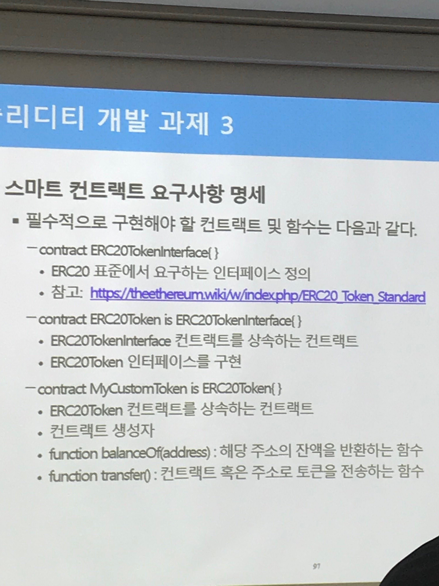
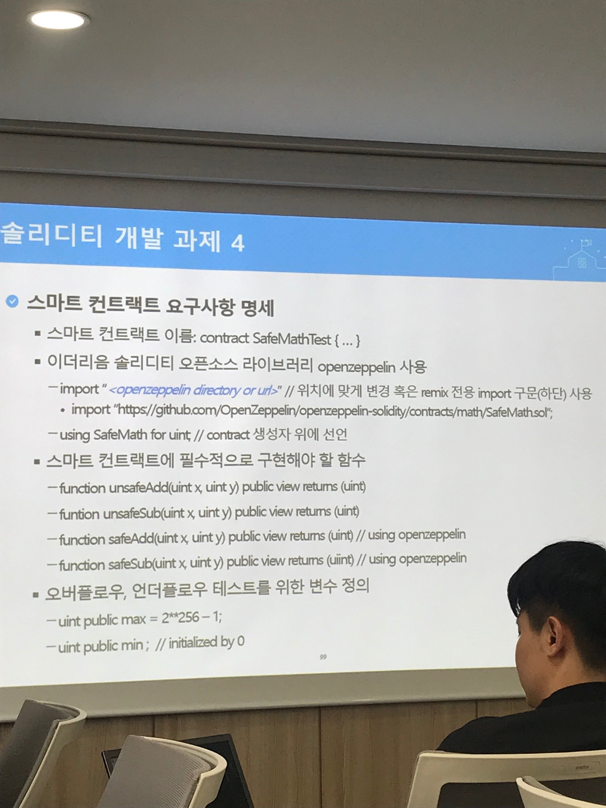
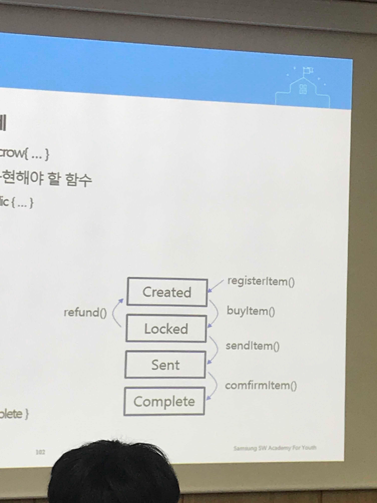
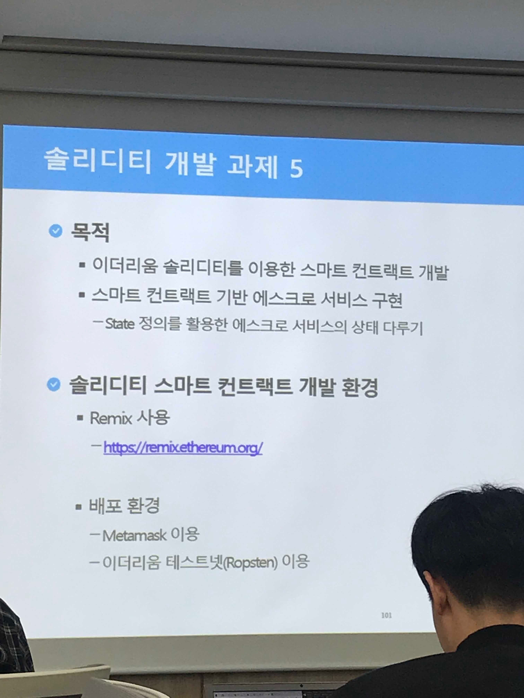
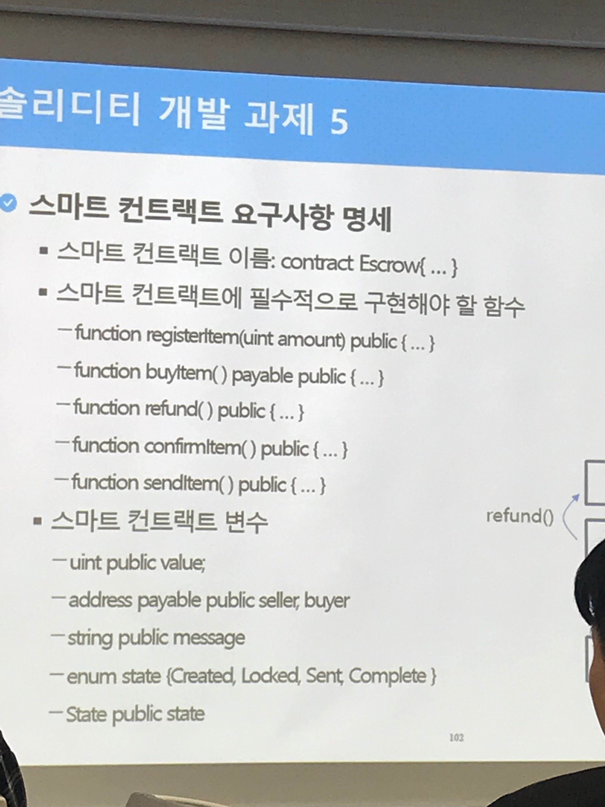

### 4. 실습 과제

#### 1) 프라이빗 이더리움 구축

* [github](<https://github.com/lkitty0302/ssafy>)
  
  * VirtualBox, Vagrant, VSCode 설치
  
* c > dev 생성 > eth_prac001 생성

* vscode에서 ctrl+`로 터미널 열기

  ```shell
  $ cd c:\dev\eth_prac001
  $ vagrant init
  ```

  * 해당 경로에 생성된 파일 열기

* Vagrantfile 코드 수정

  ```text
  Vagrant.configure("2") do |config|
    config.vm.define "eth01" do |eth01|
      eth01.vm.box = "ubuntu/bionic64"
      eth01.vm.hostname = "eth01"
      eth01.vm.network "private_network", ip: "192.168.50.10"
      eth01.vm.provider "virtualbox" do |eth01v|
        eth01v.memory = 4096
      end
    end
    config.vm.define "eth02" do |eth02|
      eth02.vm.box = "ubuntu/bionic64"
      eth02.vm.hostname = "eth02"
      eth02.vm.network "private_network", ip: "192.168.50.11"
      eth02.vm.provider "virtualbox" do |eth02v|
        eth02v.memory = 4096
      end
    end
  end
  ```

* vscode terminal

  ```shell
  $ vagrant up eth01
  $ vagrant up eth02
  ```

* 각각의 터미널에서 가상머신에 접속

  ```bash
  $ vagrant ssh eth01
  $ vagrant ssh eth02
  ```

* 1번 가상머신에서 Geth(Go-ethereum client) 설치

  ```shell
  sudo apt-get update
  sudo apt-get install software-properties-common
  sudo add-apt-repository -y ppa:ethereum/ethereum
  sudo apt-get install ethereum
  ```

* 설치 확인

  ```shell
  geth version
  ```

* 2번에서도 똑같이

* eth01 가상미션에서 프라이빗 이더리움을 위한 genesis 블록파일 생성

  ```shell
  $ mkdir -p dev/eth_localdata
  $ cd dev/eth_localdata
  $ vi CustomGenesis.json
  ```

  ```json
  {
    "config": {
      "chainId": 921,
      "homesteadBlock": 0,
      "eip155Block": 0,
      "eip158Block": 0
    },
    "alloc": {},
    "coinbase":"0x0000000000000000000000000000000000000000",
    "difficulty": "0x20",
    "extraData": "",
    "gasLimit": "0x47e7c5",
    "nonce": "0x0000000000000042",
    "mixhash": "0x0000000000000000000000000000000000000000000000000000000000000000",
    "parentHash": "0x0000000000000000000000000000000000000000000000000000000000000000",
    "timestamp": "0x00"
   }
  ```

  * Geth 초기화

    ```shell
    $ geth --datadir /home/vagrant/dev/eth_localdata init /home/vagrant/dev/eth_localdata/CustomGenesis.json
    ```

  * 정상적으로 초기화 시 workplace 내에 파일들이 생성됨

    ```shell
    sudo apt-get install tree
    tree
    ```

* Geth 구동

  * eth01 가상머신에서

    ```shell
    geth --networkid 921 --maxpeers 2 --datadir /home/vagrant/dev/eth_localdata --port 30303 console
    ```

  * eth02 가상머신에서

    ```shell
    geth --networkid 921 --maxpeers 2 --datadir /home/vagrant/dev/eth_localdata --port 30304 console
    ```

* 노드 연결

  * eth01 가상머신 / Geth console

    ```shell
    admin.nodeInfo.enode
    ""
    ```

  * 복사해서 eth02 Geth console에서

    ```
    admin.addPeer("")
    ```

  * 1번에서 확인 가능

    ```shell
    admin.peers
    ```

* 이더리움 계정(EOA) 생성

  * eth01

    ```geth console
    personal.newAccount("test1234")
    ""
    ```

  * 생성된 계정 확인

    ```geth console
    eth.accounts
    ```

  * eth02에서도 동일하게 진행

* 트랜잭션 생성

  * 트랜잭션 생성을 위한 이더 채굴

  * eth01

    ```shell
    miner.start(1)
    true
    ```

  * 20여개의 블록 채굴 확인 후 mining 종료

    ```shell
    miner.stop()
    true
    ```

  * 채굴 보상으로 획득한 이더 잔액 확인 ("계정명")

    ```shell
    eth.getBalance("0x13c2046228932cd8d6c7471ae821cbd773238372")
    ```

  * 트랜잭션 생성

    * eth01 가상머신

      ```shell
      eth.sendTransaction({from:"0x13c2046228932cd8d6c7471ae821cbd773238372", to: "eth02 account", value: web3.toWei(1, "ether")})
      ```

    * 피어 연결이 안 됐으면 안 될 거예요.

  * (1반) 계정 Locked 해제 방법

    ```shell
    web3.personal.unlockAccount(eth.coinbase)
    web3.personal.unlockAccount(eth.coinbase, "계정명")
    personal.unlockAccount("주소")
    ```

* 피어도 안 붙고 제대로 되는 게 없어서 바로 과제로 넘어간다고...

* remix 홈페이지 접속, metamask 크롬에 추가, 계정 생성

* metamask에서

  * Ropsten 테스트넷으로 변경 후 파우셋 테스트로 이더 얻기

#### 2) Geth console 실습

#### 3) 솔리디티 개발 과제 1

- remix 홈페이지 접속, metamask 크롬에 추가, 계정 생성

- metamask에서

  - Ropsten 테스트넷으로 변경 후 파우셋 테스트로 이더 얻기

- remix 홈페이지에서 과제 진행

  - solidity > compiler > 0.5.2+commit ~로 선택 (0.5.2 이상으로)

  - FILE EXPLORERS에서 +로 SimpleStorage.sol 생성

    ```sol
    pragma solidity 0.5.2; 
    
    contract SimpleStroage {
       uint256 value;
    
       constructor() public {
           value = 0;
       }
    
       function setValue(uint256 _value) public {
           value = _value;
       }
    
       function getValue() public view returns(uint256) {
           return value;
       }
    }
    ```

    - 컴파일 버전 명시
    - 클래스
      - unsigned int 선언하고
      - view도 있고 ?도 있고 상황에 따라 맞는 걸로 선언
    - 저장하고 deploy > `>` > 90 입력 후 setValue > getValue > 뜸

#### 4) 솔리디티 개발 과제 2

* ballot.sol 코드 분석

```sol
pragma solidity >=0.4.22 <0.6.0;
contract Ballot {

    struct Voter {
        uint weight;
        bool voted;
        uint8 vote;
        address delegate;
    }
    struct Proposal {
        uint voteCount;
    }

    address chairperson;
    mapping(address => Voter) voters;
    Proposal[] proposals;

    /// Create a new ballot with $(_numProposals) different proposals.
    constructor(uint8 _numProposals) public {
        chairperson = msg.sender;
        voters[chairperson].weight = 1;
        proposals.length = _numProposals;
    }

    /// Give $(toVoter) the right to vote on this ballot.
    /// May only be called by $(chairperson).
    function giveRightToVote(address toVoter) public {
        if (msg.sender != chairperson || voters[toVoter].voted) return;
        voters[toVoter].weight = 1;
    }

    /// Delegate your vote to the voter $(to).
    function delegate(address to) public {
        Voter storage sender = voters[msg.sender]; // assigns reference
        if (sender.voted) return;
        while (voters[to].delegate != address(0) && voters[to].delegate != msg.sender)
            to = voters[to].delegate;
        if (to == msg.sender) return;
        sender.voted = true;
        sender.delegate = to;
        Voter storage delegateTo = voters[to];
        if (delegateTo.voted)
            proposals[delegateTo.vote].voteCount += sender.weight;
        else
            delegateTo.weight += sender.weight;
    }

    /// Give a single vote to proposal $(toProposal).
    function vote(uint8 toProposal) public {
        Voter storage sender = voters[msg.sender];
        if (sender.voted || toProposal >= proposals.length) return;
        sender.voted = true;
        sender.vote = toProposal;
        proposals[toProposal].voteCount += sender.weight;
    }

    function winningProposal() public view returns (uint8 _winningProposal) {
        uint256 winningVoteCount = 0;
        for (uint8 prop = 0; prop < proposals.length; prop++)
            if (proposals[prop].voteCount > winningVoteCount) {
                winningVoteCount = proposals[prop].voteCount;
                _winningProposal = prop;
            }
    }
}
```

* Voter 구조체와 Proposal 구조체의 쓰임

  |                                                       | Voter | Proposal |
  | ----------------------------------------------------- | ----- | -------- |
  | 구조체를 구성하는 변수                                |       |          |
  | 구조체와 구조체의 리스트를 선언하고 사용할 수 있는가? |       |          |

* msg.sender는 무엇을 뜻하는가?

  * msg.sender와 같은 특성을 갖는 변수를 무엇이라 지칭하는가?

* 조건문, 반복문을 사용할 수 있는가?

* 생성자 및 함수의 선언을 이해할 수 있는가?

* 생성자 및 함수의 동작을 설명할 수 있는가?

  * constructor
  * givRightToVote(address toVoter)
  * delegate(address to)
  * vote(uint8 toProposal)
  * winningProposal() returns (uint8 _winningProposal)

* givRightToVote 함수의 if문을 require문으로 변경할 수 있는가?

* 함수 내 storage 변수를 설명할 수 있는가?

* Openzeppelin SafeMath 라이브러리를 사용하여 코드를 변경할 수 있는가?

* Ballot.sol은 모든 참가자에게 투표권을 부여할 수 있는 형태인가?

* 여러 투표에 투표할 수 있는 컨트랙트로 확장할 수 있는 방법은 무엇인가?

####  5) 솔리디티 개발 과제 3

* 이더리움 ERC20 위키 자료에서 샘플코드 보고 공부

* 스마트 컨트랙트 요구사항 명세

  * 솔리디티 컴파일러는 0.4.18 버전 이상을 사용한다.

    * view -> constant
    * 생성자 -> function ContractName() ~

  * ERC20을 준수하는 토큰의 특징은 다음과 같다.

    * Token name = MyCustomToken
    * Token symbol = "MCT"
    * Token total supply = 1000000000 (10억개)
    * Token decimals = 18
    * Token per ETH = 10(1 eth 당 10 MCT)

  * 필수적으로 구현해야 할 컨트랙트 및 함수는 다음과 같다.

    

#### 6) 솔리디티 개발 과제 4





#### 7) 솔리디티 개발 과제 5





* contractEscrow.sol

  ```sol
  pragma solidity >=0.4.22 <0.6.0;
  
  contract EscrowTest{
      uint public value;
      address payable public seller;
      address payable public buyer;
      string public message;
      enum State {Created, Locked, Sent, Complete}
      State public state;
      mapping(address=> uint) balanceOf;
      function registrItem(uint amount)public{
          seller = msg.sender;
          state = State.Created;
          value = amount;
      }
      function buyItem() public payable {
          require(msg.value == value, "insert correct price");
          buyer = msg.sender;
          balanceOf[seller] += value;
          state = State.Locked;
      }
      function refund() public{
          require(state == State.Locked, "state is not lockded");
          balanceOf[seller] -= value;
          selfdestruct(buyer);
          state = State.Created;
      }
      function confirmItem() public{
          require(buyer == msg.sender, "You are not buyer");
          require(state == State.Sent, "state is not sent");
          selfdestruct(seller);
          state = State.Complete;
      }
      function sendItem() public{
          require(seller == msg.sender, "You are not seller");
          require(state == State.Locked, "state is not locked");
          state = State.Sent;
      }
  }
  ```

  * require에서 false가 뜨면 gas부터 data 저장된 것까지 전부 초기화됨
  * Deploy에서 해보기
    * Injected Web3로 바꾸고 연결 허용하고 친구 주소 복사해서 At Address에 넣고
    * deploy 누르면 오른쪽 안내창에서 컨트랙트 배포 승인됨 확인 가능
    * deployed contracts에서 contract 확인 가능
    * 가격 1로 하고 registrItem 누르면 구매자가 buyItem 누르고 
    * confirm 할 때 위에서 Value값 넣어야 한다는 듯
  * 순서 다시
    * Web3로 바꾸고 deploy 눌러서 contract 배포
    * 배포된 contract를 복사해서 친구가 at address로 접근
    * 한쪽에서 registrItem을 하면 다른쪽에서 buyItem
    * buyer와 seller에 주소가 떠야 정상
    * 승인되면 registr한 쪽에서 sendItem
    * value 입력하고 (ether) confirmItem

* 답안
  * <https://github.com/ldh1428a/ssafy>


* takhee 쌤이 알려준 강좌

  * <https://programmers.co.kr/learn/courses/7015/lessons/41788#>

* 1반에서 올려준 코드. 어느 거 답인지는 모름.

  ```sol
  pragma solidity >=0.4.22 <0.6.0;
  import "https://github.com/OpenZeppelin/openzeppelin-solidity/blob/master/contracts/math/SafeMath.sol";
  contract SafeMathTest{
     using SafeMath for uint;
     uint public max;
     uint public min;
     constructor() public{
         max = 2**256-1;
         min = 0;
     }
     function unsafeAdd(uint x, uint y) public pure returns(uint){
         return x+y;
     }
     function unsafeSub(uint x, uint y) public pure returns(uint){
         return x-y;
     }
     function safeAdd(uint x, uint y) public pure returns(uint){
         return SafeMath.add(x,y);
     }
     function safeSub(uint x, uint y) public pure returns(uint){
         return SafeMath.sub(x,y);
     }
  }
  ```

  