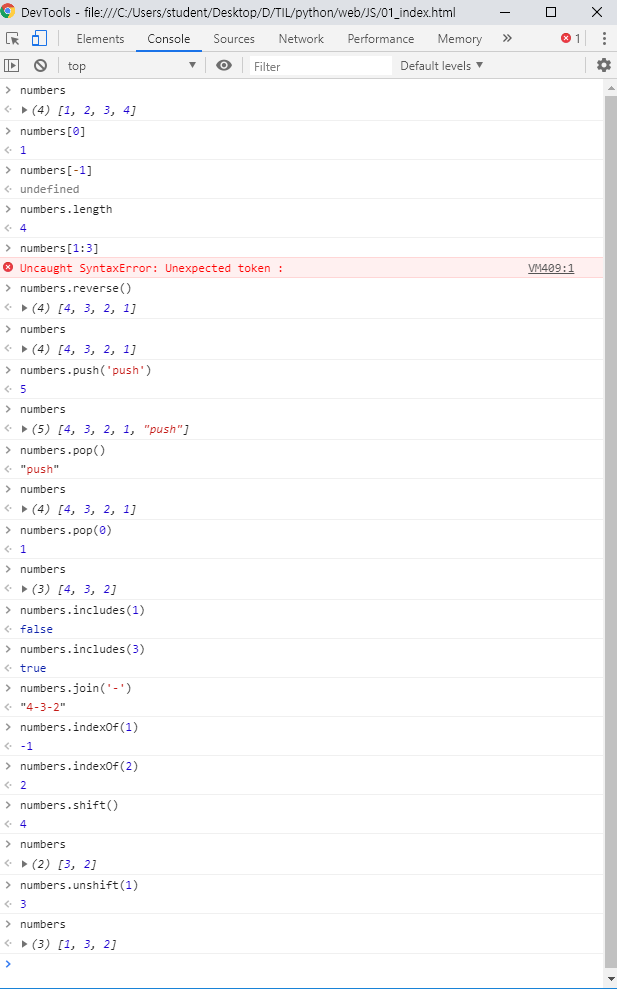

# Javascript

> os에서 시작된 프로그래밍 언어가 아님. 브라우저에서 시작됨. 초기엔 프로그래밍 언어 취급도 받지 못함.
>
> 함수형 일부 채택. 객체 지향 일부 채택. 우여곡절이 많았던 언어.

## Javascript란?

* 브라우저 상에서 dynamism, action을 표현하기 위해 탄생한 언어.
* Java랑 전혀 관련 없음. 당시 Java 인기가 많아 앞에 붙였을 뿐.
* ES6 ?
  * 브라우저 조작용 언어라 매우 심하게 분화됨.
  * 묶으려고 생겨난 표준안이 ECMA.
  * ECMA Script ver.6
  * 우리는 ES6+ 기준으로 강의 - 2015
* 인터넷 세상
  * 넷스케이프 - IE - 
  * V8엔진으로 크롬이 점유율을 많이 차지했는데 최근에 파폭이 만든 게 빠르다고
  * 파폭이 표준을 잘 지키며 개발자들을 위한 브라우저도 만들어줘서 성장
    * 파폭이 보안 관련 등 필요 요소를 가장 먼저 반영해주는 편.
* JS는 브라우저를 구동하기 위한 언어이다보니 브라우저마다 달랐음. 표준이 뭉쳐 만들어진 게 지금.

  * Vanilla JS - 순정으로 돌아가자는 운동. 표준이 만들어짐. 그래서 JQuery가 밀려남.

* 크롬 - 검사 - Console에서 Javascript를 실행해볼 수 있음.

  * window

  ```javascript
  window.innerWidth
  window.print() // 프린트 창 열림
  window.location.href = '주소' // 원하는 주소로 이동 가능
  ```

  * document

  ```javascript
  document.title = 'edussafy'
  document.write('hello, angel')
  document.write('<h1>hello, angel</h1>')
  ```

* 반복, 조건, 분기도 가능.
* nodeJS
  * 프론트엔드를 벗어난 서버사이드 프로그래밍 지원
  * JavaScript 점유율 상승
    * 사용자 수 부동의 1위. 2, 3위 HTML, CSS보다 높음.

## 시작

* 크롬과 VS Code에서 실습.
* VS Code에서 `JavaScript (ES6) code snippets` install.
  * `open in browser` : `alt` + `b` 로 브라우저 열기
* body 닫는 태그 위에 `<script></script>`
  * 사용자가 불러오고 있다는 걸 느낄 수 있도록.
  * 의견은 다양함.
* `;`도 논쟁이 있음
  * 수업에선 사용 안 할 예정. 없어서 발생하는 오류가 거의 없음. 

* 들여쓰기도 필수는 아닌데 하는 편이 좋지.

### Print

* 주석

  ```javascript
  // one line
  /*
  multi line
  */
  ```

* alert

  ```javascript
  alert('Hello, JavaScript!')
  ```

* console

  * 콘솔창에 출력. 앞으로 여기에 찍으며 연습할 것.

  ```javascript
  console.log('Hi!')
  ```

* document.write

  * 이렇게 직접 쓰진 않지만, 가능하다는 것.

  ```javascript
  document.write('<h1>EXO</h1>')
  ```

### Variable

* document 객체 조작

  ```javascript
  document.querySelector('h1').innerText = 'EXO-CBX'
  var h1 = document.querySelector('h1')
  h1.innerText = 'Kaching!'
  ```

* 출력 먼저 해도 동작함

  * 변수는 1) 선언단계 2) 초기화 단계(undifined) 3) 할당 단계를 거친다.

  ```javascript
  console.log(name) // 크롬에서는 shift+enter로 // 결과 : undefined
  var name = '경수'
  ```

  * `hoisting`
    * javascript가 기본으로 하는 기능
    * 선언을 끌어올림

  ```javascript
  console.log(phoneNumber) // phoneNumber is not defined error(Reference Error)
  ```

* 변수 클리어

  ```javascript
  clear()
  ```

* 변수 선언

  * 키워드 + 변수로 선언

    * 키워드가 없으면 전역변수로 선언됨. 사용하지 않음.

  * 키워드 `var`

    * 재선언이 가능하다는 문제점.
    * 상수 선언 불가능.

  * 키워드 `let` : 재 선언을 방지.  변수.

    ```javascript
    let e = 100
    let e = 20 // Identifier 'e' has already been declared
    ```

  * 키워드 `const` : 상수. 값을 바꿀 수 없음.

  * `var`와 `let`의 scope 차이

    ```javascript
    for (var i = 0; i < 3; i++) {
        console.log(i)
    }
    console.log('===============')
    console.log(i) // 3
    
    for (let j = 0; j < 3; j++) {
        console.log(j)
    }
    console.log('===============')
    console.log(j) // 에러 발생: j is not defined
    ```

  * 예전에는 var를 썼지만, 대세는 let과 const 사용. 재선언이 불가능하므로.

* CamelCase 사용. JavaScript에서 많이 씀.

* Template Literal (템플릿 문자열)

  ```javascript
  const firstName = 'Happy'
  const lastName = 'Hacking'
  const name = firstName + lastName
  // document.write('<h1>'+ name + '</h1>')
  document.write(`<h1>${name}</h1>`) // ES6+ : Template literal(템플릿 문자열)
  ```

* prompt : html에서 input과 유사

  ```javascript
  let userName = prompt('Who are you?')
  let message = `<h1>${userName}</h1>`
  document.write(message)
  ```

### If

* 조건문

  * 기본적으로 if에서 비교는 `===`
  * `==` : 비슷
    * 0 == '0' : true
    * 0 == [] : true
    * '0' == [] : false
    * true, false 소문자

  ```javascript
  let userName = prompt('Who are you?')
  let message = `<h1>${userName}</h1>`
  
  // JavaScript에서 === 은 python의 == 과 같은 비교 연산자이다.
  // === : 일치함을 비교 (값, 타입)
  // == : 동등함을 비교 (값) : 타입이 암묵적 변환
  // 123 == '123' : true
  // !==, !=
  
  if (userName === 'Chen') {
      message = `<h1>4월이 지나도 헤어지지 말아요, 우리.</h1>`
  } else if (userName == '경수') {
      message = `<h1>보고싶어 ${userName}야</h1>`
  } else {
      message = `<h1>${userName}, 환영합니다.</h1>`
  }
  document.write(message)
  ```

### 반복문

* `++` , `--` (앞, 뒤)

* while

  ```javascript
  let i = 0
  while (i < 10) {
      console.log(i)
      i ++ 
  }
  ```

* for

  ```javascript
  // for
  for (let j=0; j < 10; j++) {
      console.log(j)
  }
  
  let myArray = [1, 2, 3]
  for (let k=0; k<10; k++) {
      console.log(myArray[k])
  }
  // for of : 배열 반복문
  // 재할당이 없다면 const를 써도 됨
  for (let k of myArray) {
      console.log(k)
  }
  ```

### Array

* myArray

  ```javascript
  let numbers = [1, 2, 3, 4]
  ```

  

  * pop() 숫자 뭘 넣어도 맨 마지막 게 뽑힘
  * list[-1] 불가능, 슬라이싱도 불가능.
  * 뒤에 넣기, 빼기 : push(), pop()
  * 앞에 넣기, 빼기 : shift(), unshift()
  * 리턴값: 넣은 뒤 전체 길이 / 뺀 원소
  * .sort() 가능
  * .slice(x, y) : x 부터 y 까지
    * .slice(-2) : 뒤에서부터 두 개
    * .slice() : 그대로 복사

### Object, Json

* JSON : JavaScript Object Notation [자료](<https://developer.mozilla.org/ko/docs/Learn/JavaScript/Objects/JSON>)

* javascript는 dictionary가 따로 정의되어있거나 하지 않음.

* 이렇게 표현은 가능

  ```javascript
  // javascript object 표기법
  let chen = {
      name: 'chen',
      age: 27,
      number: '010-0921-0408'
  }
  console.log(chen.name)
  console.log(chen.age)
  console.log(typeof chen) // object
  console.log(typeof [1, 2, 3]) // object
  ```

* 실제  type은 dictionary가 아니라 **object**

  * dic[key] 보다는 object.key로 가져와서 씀

* 위에서 쓴 array도 실제로는 **object**

*  javascript data type

  1. 원시 타입 (primitive type)

  * Boolean(true, false), null, undefined, number, string

  1. 그 외 - 모두 object

* ES6+ 사용법

  * 변수를 그대로 넣으면 '변수명: 값'으로 만들어준다.

  ```javascript
  // ES6+
  let name = 'baekhyun'
  let gifts = ['light', 'voice', 'dance', 'smile']
  let baekhyun = {
      name, gifts
  }
  ```

  * JSON은 `""` 필수
  * JSON : 이 표기법을 쓴 '문자열'

  ```javascript
  // json <-> object
  let jsonData = JSON.stringify(baekhyun)
  // 찍어보면 : "{"name":"baekhyun","gifts":["light","voice","dance","smile"]}"
  let jsonParse = JSON.parse(jsonData)
  ```

  * 이렇게 parse 해서 사용.

### 함수

```javascript
// 1. 함수 선언식
let result = add(1, 3) // hoisting 가능
function add(num1, num2) {
    return num1 + num2
}
console.log(result)

// 2. 함수 표현식
let add2 = function add3(num1, num2) {
    return num1 + num2
}
console.log(add2(1, 3))
// console.log(add3(1, 3)) // Uncaught ReferenceError: add3 is not defined
// 함수 표현식 기본 (권장) : 익명함수 사용
let add4 = function (num1, num2) {
    return num1 + num2
}
console.log(add4(1, 3))
// 함수 선언식을 써도 javascript는 실제로 이렇게 받아감

// 3. ES6+ Arrow Function
let sub = (num1, num2) => {return num1-num2}

// 인자가 하나인 경우, () 생략 가능
// 단순 리턴인 경우, {} 및 리턴 키워드 생략 가능
let greeting = name => `Welcome, ${name}.`
console.log(greeting('Chen'))

let mul = (num1, num2) => num1 * num2
console.log(mul(1, 4))

// 인자가 없는 경우 () 작성
let hello = () => 'Hello, World!'
console.log(hello())

// object return : return값을 반드시 ()로 묶어서 표현
let me = (name, age) => ({name, age})
console.log(me('Chen', 27))
```

* `.py` 를 `.js`로 변경해보기

  ```python
  def negative(num):
      return -1*num
  def gutenTag():
      return 'Guten Tag'
  def vietnam(member):
      member_base = '민지'
      return f'{member_base}와 {member}가 베트남에 가요.'
  ```

  ```javascript
  const negative = num => -1*num
  const gutenTag = () => 'Guten Tag'
  const vietnam = member => {
      let member_base = '민지'
      return `${member_base}와 ${member}(이)가 베트남에 가요.`
  }
  ```

* 기본 인자 넣어주기

  ```javascript
  // 만약, default args (기본인자) 를 넣어주고 싶다면
  let bonjour = (name='Xiumin') => `${name}, bonjour.`
  ```

* 익명 함수, 즉시 실행 함수

  ```javascript
  // 4. 익명 함수
  (function (num) {return num*num})
  (num => num*num)
  
  // 5. 즉시 실행 함수 (익명함수 + 호출) - IIFE (Immediately Invoked Function Expression)
  (function (num) {return num*num})(5)
  (num => num*num)(5)
  // 초기화 시 많이 사용함
  ```

* 연습

  * 연습) 배열을 받아 다 더해주는 함수

  ```javascript
  const numberAddEach = numbers => {
      let result = 0
      for (const k of numbers){
          result += k
      }
      return result
  }
  console.log(numberAddEach([1, 2, 3]))
  ```

  * 일반적으로 const로 쓸 수 있는 건 대부분 const를 사용하고 꼭 let이어야만 하는 걸 let으로 선언.
  * 함수를 재선언하고 수정하진 않으니 함수는 보통 const

* callback

  ```javascript
  const numberEach = (numbers, calc) => {
      let result
      for (const number of numbers) {
          result = calc(number, result)
      }
      return result
  }
  
  const addEach = (number, result=0) => result + number
  const subEach = (number, result=0) => result - number
  const mulEach = (number, result=1) => result * number
  
  console.log(numberEach([1, 2, 3], addEach))
  console.log(numberEach([1, 2, 3], subEach))
  console.log(numberEach([1, 2, 3], mulEach))
  
  // 실제로는 이런 식으로 작성 (익명함수 + 콜백)
  console.log(numberEach([1, 2, 3], (number, result=0) => result + number))
  console.log(numberEach([1, 2, 3], function(number, result=0) {
      return result + number
  }))
  ```

* 대표적인 콜백 함수

  * for ~ of 보다 더 많이 쓰는 반복문

  ```javascript
  let foods = ['pasta', 'pizza', 'rice']
  foods.forEach(function(food){
      console.log(food)
  })
  // foods.forEach(food => console.log(food))
  ```

  * 함수 인자로 idx, element, 원본 array 를 보낼 수 있음.

* 콜백 함수 + 비동기 (내일 배울 예정)

  * javascript는 single thread 언어.

    * python은 blocking, javascript는 non-blocking.

  * 브라우저가 뻗는 걸 막기 위해 javascript는 함수를 수행하지 않고 그냥 넘겨서 실행시켜버림.

  * 기본적으로 기다리지 않음.

  * 돌아오는 걸 약속하기 위한 개념 - promise

  * callback은 돌아왔을 때 원하는 기능을 수행하기 위해 존재

  * 왔을 때 이 함수를 수행시키라고 callback 함수를 함수 통 안에 넣어놓는 것. (스택에 쌓듯이)

  * 예)

    ```javascript
    console.log('Hi')
    setTimeout(function cb1(){
        console.log('cb1');
    }, 5000);
    console.log('Bye')
    // Hi - Bye - cb1
    ```

> JavaScript의 함수는 1급 객체.
>
> ** 1급 객체의 특징(조건) 
>
> 1. 변수나 특정한 오브젝트에 함수를 저장할 수 있다.
>
> 2. 함수를 함수의 인자로 전달할 수 있다.
>
> 3. 함수 자체를 return할 수 있다.
>
> 4. 익명으로 표현 가능하다.
>
> 5. 속성값(property) 동적 할당이 가능하다.
>
>    ```javascript
>    // 예) 함수 numberEach에 속성값을 지정할 수 있다.
>    numberEach.title = '숫자로 이런저런 계산을 해보자.'
>    ```


### 복습

1. `let`, `const`

2. `==`, `===`

3. `function`

   \+ `arrow function`

   \+ `익명함수`

   ==========

   \+ `콜백`

